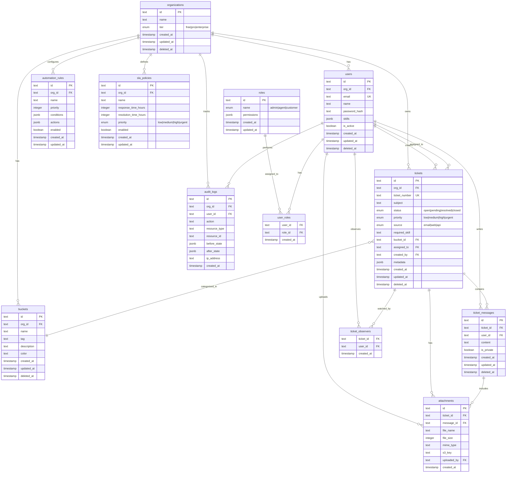

# Entity Relationship Diagram (ERD) - Ticketing Platform Database

## Overview

This document provides a comprehensive Entity Relationship Diagram (ERD) for the Ticketing Platform database, including all tables, their relationships, indexes, and the rationale behind each design decision.

The database is designed as a **multi-tenant PostgreSQL database** using **Drizzle ORM** with the following key principles:
- **Organization-based data isolation** for multi-tenancy
- **Soft deletes** for data retention and audit trails
- **Optimized indexes** for query performance
- **Cascade deletes** for referential integrity
- **JSON metadata fields** for extensibility

---

## Visual ERD Diagram



---

## Database Enums

The database uses PostgreSQL enums for type safety and data integrity:

### `ticket_status`
- **Values**: `open`, `pending`, `resolved`, `closed`
- **Purpose**: Defines the lifecycle state of a ticket
- **Workflow**: `open` → `pending` → `resolved` → `closed`
- **Usage**: Used in `tickets.status` column

### `ticket_priority`
- **Values**: `low`, `medium`, `high`, `urgent`
- **Purpose**: Indicates the urgency level of a ticket
- **Usage**: Used in `tickets.priority` and `sla_policies.priority` columns

### `ticket_source`
- **Values**: `email`, `web`, `api`
- **Purpose**: Tracks how a ticket was created
- **Usage**: Used in `tickets.source` column

### `org_tier`
- **Values**: `free`, `pro`, `enterprise`
- **Purpose**: Defines the subscription tier of an organization
- **Usage**: Used in `organizations.tier` column
- **Business Logic**: Can be used for feature gating and SLA limits

### `role_name`
- **Values**: `admin`, `agent`, `customer`
- **Purpose**: Defines the base role types in the system
- **Usage**: Used in `roles.name` column
- **Note**: Permissions are stored as JSON array for flexibility

---

## Core Tables

### 1. `organizations`

**Purpose**: Multi-tenant root entity that isolates all data by organization.

**Columns**:
- `id` (PK, text): Unique organization identifier
- `name` (text): Organization display name
- `tier` (enum): Subscription tier (`free`, `pro`, `enterprise`)
- `created_at` (timestamp): Record creation timestamp
- `updated_at` (timestamp): Last update timestamp
- `deleted_at` (timestamp, nullable): Soft delete timestamp

**Design Rationale**:
- **Multi-tenancy**: Every table (except `roles`) references `organizations.id` to ensure data isolation
- **Soft deletes**: `deleted_at` allows data retention for audit and recovery
- **Tier system**: Enables feature gating and SLA limits based on subscription level

**Relationships**:
- One-to-many with `users`, `tickets`, `buckets`, `automation_rules`, `sla_policies`, `audit_logs`

---

### 2. `roles`

**Purpose**: Defines system-wide roles with permissions. Not organization-scoped to allow shared role definitions.

**Columns**:
- `id` (PK, text): Unique role identifier
- `name` (enum, unique): Role name (`admin`, `agent`, `customer`)
- `permissions` (jsonb): Array of permission strings
- `created_at` (timestamp): Record creation timestamp
- `updated_at` (timestamp): Last update timestamp

**Design Rationale**:
- **Global roles**: Not tied to organizations to allow shared role definitions across tenants
- **Flexible permissions**: JSON array allows dynamic permission management
- **Default roles**: System creates three default roles on initialization

**Relationships**:
- Many-to-many with `users` via `user_roles` junction table

**Example Permissions**:
```json
["tickets.create", "tickets.view", "tickets.update", "tickets.delete"]
```

---

### 3. `users`

**Purpose**: User accounts with organization association and authentication.

**Columns**:
- `id` (PK, text): Unique user identifier
- `org_id` (FK → organizations.id): Organization the user belongs to
- `email` (text, indexed): User email address (unique per organization)
- `name` (text): User display name
- `password_hash` (text): Bcrypt hashed password
- `skills` (jsonb): Array of skill tags (e.g., `["technical-support", "billing"]`)
- `is_active` (boolean): Account active status
- `created_at` (timestamp): Record creation timestamp
- `updated_at` (timestamp): Last update timestamp
- `deleted_at` (timestamp, nullable): Soft delete timestamp

**Indexes**:
- `org_user_idx`: Composite index on `(org_id, id)` for efficient org-scoped queries
- `email_idx`: Index on `email` for login lookups

**Design Rationale**:
- **Organization scoping**: Every user belongs to exactly one organization
- **Skills system**: JSON array allows flexible skill tagging for ticket routing
- **Soft deletes**: Preserves user data for audit trails
- **Active flag**: Allows disabling accounts without deletion

**Relationships**:
- Many-to-one with `organizations`
- Many-to-many with `roles` via `user_roles`
- One-to-many with `tickets` (as creator and assignee)
- One-to-many with `ticket_messages`
- One-to-many with `ticket_observers`
- One-to-many with `attachments`
- One-to-many with `audit_logs`

---

### 4. `user_roles`

**Purpose**: Junction table for many-to-many relationship between users and roles.

**Columns**:
- `user_id` (FK → users.id): User identifier
- `role_id` (FK → roles.id): Role identifier
- `created_at` (timestamp): Assignment timestamp

**Design Rationale**:
- **Many-to-many**: Users can have multiple roles (e.g., admin + agent)
- **Cascade deletes**: When user or role is deleted, associations are automatically removed
- **No primary key**: Composite key would be `(user_id, role_id)`, but Drizzle handles this

**Relationships**:
- Many-to-one with `users` (cascade delete)
- Many-to-one with `roles` (cascade delete)

---

### 5. `tickets`

**Purpose**: Core entity representing customer support tickets.

**Columns**:
- `id` (PK, text): Unique ticket identifier
- `org_id` (FK → organizations.id): Organization that owns the ticket
- `ticket_number` (text, unique, indexed): Human-readable ticket number (format: `TCK-XXXX-XXXX`)
- `subject` (text): Ticket subject line
- `status` (enum): Ticket status (`open`, `pending`, `resolved`, `closed`)
- `priority` (enum): Ticket priority (`low`, `medium`, `high`, `urgent`)
- `source` (enum): Creation source (`email`, `web`, `api`)
- `required_skill` (text, nullable): Skill tag required for ticket handling
- `bucket_id` (FK → buckets.id, nullable): Category bucket assignment
- `assigned_to` (FK → users.id, nullable): Assigned agent
- `created_by` (FK → users.id): User who created the ticket
- `metadata` (jsonb): Flexible JSON for additional data
- `created_at` (timestamp): Ticket creation timestamp
- `updated_at` (timestamp): Last update timestamp
- `deleted_at` (timestamp, nullable): Soft delete timestamp

**Indexes**:
- `org_status_idx`: Composite index on `(org_id, status)` for filtering tickets by org and status
- `ticket_number_idx`: Unique index on `ticket_number` for fast lookups
- `created_at_idx`: Index on `created_at` for time-based queries
- `bucket_idx`: Index on `bucket_id` for bucket filtering

**Design Rationale**:
- **Ticket numbering**: Unique, indexed `ticket_number` for customer-facing references
- **Status workflow**: Enum ensures valid state transitions
- **Skill-based routing**: `required_skill` enables automatic agent assignment
- **Bucket categorization**: Optional bucket for ticket organization
- **Metadata flexibility**: JSON field allows custom fields without schema changes
- **Soft deletes**: Preserves ticket history for reporting

**Relationships**:
- Many-to-one with `organizations`
- Many-to-one with `buckets` (nullable)
- Many-to-one with `users` (as assignee, nullable)
- Many-to-one with `users` (as creator)
- One-to-many with `ticket_messages`
- One-to-many with `ticket_observers`
- One-to-many with `attachments`

---

### 6. `ticket_messages`

**Purpose**: Messages/replies within tickets, supporting public and private messages.

**Columns**:
- `id` (PK, text): Unique message identifier
- `ticket_id` (FK → tickets.id): Parent ticket
- `user_id` (FK → users.id): Message author
- `content` (text): Message body
- `is_private` (boolean): Whether message is private (agents/admins only)
- `created_at` (timestamp): Message creation timestamp
- `updated_at` (timestamp): Last update timestamp
- `deleted_at` (timestamp, nullable): Soft delete timestamp

**Design Rationale**:
- **Privacy control**: `is_private` flag allows internal agent notes
- **Cascade delete**: Messages are deleted when ticket is deleted
- **Soft deletes**: Preserves message history for audit

**Relationships**:
- Many-to-one with `tickets` (cascade delete)
- Many-to-one with `users`
- One-to-many with `attachments`

---

### 7. `ticket_observers`

**Purpose**: Junction table for users watching/following tickets.

**Columns**:
- `ticket_id` (FK → tickets.id): Ticket being observed
- `user_id` (FK → users.id): User observing the ticket
- `created_at` (timestamp): Observation start timestamp

**Indexes**:
- `ticket_observer_idx`: Composite unique index on `(ticket_id, user_id)` to prevent duplicates
- `ticket_observer_ticket_idx`: Index on `ticket_id` for ticket queries
- `ticket_observer_user_idx`: Index on `user_id` for user queries

**Design Rationale**:
- **Watch functionality**: Allows users to follow tickets for notifications
- **Cascade deletes**: Automatically removes observers when ticket or user is deleted
- **Composite index**: Ensures one observation record per ticket-user pair

**Relationships**:
- Many-to-one with `tickets` (cascade delete)
- Many-to-one with `users` (cascade delete)

---

### 8. `attachments`

**Purpose**: File attachment metadata linked to tickets and messages.

**Columns**:
- `id` (PK, text): Unique attachment identifier
- `ticket_id` (FK → tickets.id): Parent ticket
- `message_id` (FK → ticket_messages.id, nullable): Optional message attachment
- `file_name` (text): Original filename
- `file_size` (integer): File size in bytes
- `mime_type` (text): MIME type (e.g., `image/png`, `application/pdf`)
- `s3_key` (text): S3/MinIO object key for file retrieval
- `uploaded_by` (FK → users.id): User who uploaded the file
- `created_at` (timestamp): Upload timestamp

**Design Rationale**:
- **Flexible attachment**: Can be attached to ticket or specific message
- **S3 storage**: `s3_key` references file in S3-compatible storage (MinIO/AWS S3)
- **Cascade deletes**: Attachments deleted when ticket or message is deleted
- **Metadata tracking**: Stores file metadata for display and validation

**Relationships**:
- Many-to-one with `tickets` (cascade delete)
- Many-to-one with `ticket_messages` (cascade delete, nullable)
- Many-to-one with `users` (uploader)

---

### 9. `buckets`

**Purpose**: Ticket categorization buckets (similar to labels/tags) for organization.

**Columns**:
- `id` (PK, text): Unique bucket identifier
- `org_id` (FK → organizations.id): Organization that owns the bucket
- `name` (text): Bucket display name
- `tag` (text, nullable): Short tag/identifier
- `description` (text, nullable): Bucket description
- `color` (text, nullable): UI color code (e.g., `#ef4444`)
- `created_at` (timestamp): Bucket creation timestamp
- `updated_at` (timestamp): Last update timestamp
- `deleted_at` (timestamp, nullable): Soft delete timestamp

**Indexes**:
- `org_bucket_idx`: Composite index on `(org_id, id)` for org-scoped queries
- `bucket_name_idx`: Index on `name` for name-based lookups

**Design Rationale**:
- **Organization scoping**: Each organization has its own buckets
- **Flexible categorization**: Allows custom ticket organization
- **UI support**: `color` field enables visual distinction in UI
- **Soft deletes**: Preserves bucket history even when deleted

**Relationships**:
- Many-to-one with `organizations`
- One-to-many with `tickets`

**Business Rules**:
- Buckets cannot be deleted if tickets are assigned to them
- Bucket names are unique within an organization

---

### 10. `automation_rules`

**Purpose**: Rule-based automation configuration for ticket processing.

**Columns**:
- `id` (PK, text): Unique rule identifier
- `org_id` (FK → organizations.id): Organization that owns the rule
- `name` (text): Rule display name
- `priority` (integer): Execution priority (higher = executed first)
- `conditions` (jsonb): Array of condition objects
- `actions` (jsonb): Array of action objects
- `enabled` (boolean): Whether rule is active
- `created_at` (timestamp): Rule creation timestamp
- `updated_at` (timestamp): Last update timestamp

**Design Rationale**:
- **Organization scoping**: Each organization configures its own rules
- **Flexible conditions**: JSON structure allows complex condition logic
- **Flexible actions**: JSON structure allows various automation actions
- **Priority system**: Integer priority determines execution order
- **Enable/disable**: Allows temporary rule deactivation

**Relationships**:
- Many-to-one with `organizations`

**Example Conditions**:
```json
[
  {
    "field": "status",
    "operator": "equals",
    "value": "open"
  },
  {
    "field": "priority",
    "operator": "equals",
    "value": "urgent"
  }
]
```

**Example Actions**:
```json
[
  {
    "type": "assign",
    "params": {
      "user_id": "user-123"
    }
  },
  {
    "type": "set_priority",
    "params": {
      "priority": "high"
    }
  }
]
```

---

### 11. `sla_policies`

**Purpose**: Service Level Agreement (SLA) policy definitions for ticket response and resolution times.

**Columns**:
- `id` (PK, text): Unique SLA policy identifier
- `org_id` (FK → organizations.id): Organization that owns the policy
- `name` (text): Policy display name
- `response_time_hours` (integer): Maximum hours for first response
- `resolution_time_hours` (integer): Maximum hours for ticket resolution
- `priority` (enum): Priority level this policy applies to
- `enabled` (boolean): Whether policy is active
- `created_at` (timestamp): Policy creation timestamp
- `updated_at` (timestamp): Last update timestamp

**Design Rationale**:
- **Organization scoping**: Each organization defines its own SLA policies
- **Priority-based**: Different SLA times for different priority levels
- **Time tracking**: Hours-based for simplicity (can be converted to minutes/seconds in application)
- **Enable/disable**: Allows temporary policy deactivation

**Relationships**:
- Many-to-one with `organizations`

**Business Logic**:
- SLA timers are tracked in Redis (not in database) for performance
- SLA breaches trigger events published to Kafka
- Multiple policies can exist per organization (one per priority level)

---

### 12. `audit_logs`

**Purpose**: Comprehensive audit trail for all user actions and data changes.

**Columns**:
- `id` (PK, text): Unique log entry identifier
- `org_id` (FK → organizations.id): Organization context
- `user_id` (FK → users.id): User who performed the action
- `action` (text): Action type (e.g., `ticket.created`, `user.updated`)
- `resource_type` (text): Type of resource affected (e.g., `ticket`, `user`)
- `resource_id` (text): ID of affected resource
- `before_state` (jsonb, nullable): Resource state before action
- `after_state` (jsonb, nullable): Resource state after action
- `ip_address` (text, nullable): IP address of request
- `created_at` (timestamp): Action timestamp

**Design Rationale**:
- **Comprehensive tracking**: Records all significant actions
- **State tracking**: `before_state` and `after_state` enable change auditing
- **Security**: IP address logging for security analysis
- **Organization scoping**: All logs are organization-scoped
- **No soft deletes**: Audit logs are never deleted (immutable)

**Relationships**:
- Many-to-one with `organizations`
- Many-to-one with `users`

**Use Cases**:
- Compliance and regulatory requirements
- Security incident investigation
- Change history tracking
- User activity monitoring

---

## Relationship Summary

### One-to-Many Relationships

1. **organizations → users**: Each organization has many users
2. **organizations → tickets**: Each organization has many tickets
3. **organizations → buckets**: Each organization has many buckets
4. **organizations → automation_rules**: Each organization has many automation rules
5. **organizations → sla_policies**: Each organization has many SLA policies
6. **organizations → audit_logs**: Each organization has many audit log entries
7. **users → tickets** (as creator): Each user creates many tickets
8. **users → tickets** (as assignee): Each user can be assigned many tickets
9. **users → ticket_messages**: Each user writes many messages
10. **users → ticket_observers**: Each user can observe many tickets
11. **users → attachments**: Each user uploads many attachments
12. **users → audit_logs**: Each user generates many audit log entries
13. **tickets → ticket_messages**: Each ticket has many messages
14. **tickets → ticket_observers**: Each ticket can be observed by many users
15. **tickets → attachments**: Each ticket has many attachments
16. **buckets → tickets**: Each bucket contains many tickets
17. **ticket_messages → attachments**: Each message can have many attachments

### Many-to-Many Relationships

1. **users ↔ roles**: Users can have multiple roles, roles can be assigned to multiple users
   - Junction table: `user_roles`
   - Cascade deletes: Both directions

2. **users ↔ tickets** (observers): Users can observe multiple tickets, tickets can be observed by multiple users
   - Junction table: `ticket_observers`
   - Cascade deletes: Both directions

---

## Index Strategy

### Composite Indexes

1. **`org_user_idx`** on `users(org_id, id)`
   - **Purpose**: Optimize org-scoped user queries
   - **Usage**: `WHERE org_id = ? AND id = ?`

2. **`org_status_idx`** on `tickets(org_id, status)`
   - **Purpose**: Optimize filtering tickets by org and status
   - **Usage**: `WHERE org_id = ? AND status = ?`

3. **`org_bucket_idx`** on `buckets(org_id, id)`
   - **Purpose**: Optimize org-scoped bucket queries
   - **Usage**: `WHERE org_id = ? AND id = ?`

4. **`ticket_observer_idx`** on `ticket_observers(ticket_id, user_id)`
   - **Purpose**: Ensure uniqueness and optimize lookups
   - **Usage**: `WHERE ticket_id = ? AND user_id = ?`

### Single-Column Indexes

1. **`email_idx`** on `users(email)`
   - **Purpose**: Fast login lookups
   - **Usage**: `WHERE email = ?`

2. **`ticket_number_idx`** on `tickets(ticket_number)`
   - **Purpose**: Fast ticket lookups by number
   - **Usage**: `WHERE ticket_number = ?`

3. **`created_at_idx`** on `tickets(created_at)`
   - **Purpose**: Time-based queries and sorting
   - **Usage**: `ORDER BY created_at DESC`

4. **`bucket_idx`** on `tickets(bucket_id)`
   - **Purpose**: Filter tickets by bucket
   - **Usage**: `WHERE bucket_id = ?`

5. **`bucket_name_idx`** on `buckets(name)`
   - **Purpose**: Name-based bucket lookups
   - **Usage**: `WHERE name = ?`

6. **`ticket_observer_ticket_idx`** on `ticket_observers(ticket_id)`
   - **Purpose**: Find all observers of a ticket
   - **Usage**: `WHERE ticket_id = ?`

7. **`ticket_observer_user_idx`** on `ticket_observers(user_id)`
   - **Purpose**: Find all tickets a user observes
   - **Usage**: `WHERE user_id = ?`

---

## Data Flow and Interconnections

### Multi-Tenancy Pattern

All data is **organization-scoped**:
1. Every table (except `roles`) has an `org_id` foreign key
2. All queries filter by `org_id` to ensure data isolation
3. Middleware enforces organization context from JWT token
4. Users can only access data from their organization

### Ticket Lifecycle

1. **Creation**: Ticket created with `status = 'open'`, `created_by` set
2. **Assignment**: `assigned_to` set to agent user ID
3. **Status Changes**: `status` transitions through workflow
4. **Messages**: `ticket_messages` added as conversation progresses
5. **Attachments**: Files uploaded and linked to ticket or message
6. **Observers**: Users can watch tickets for notifications
7. **Resolution**: `status = 'resolved'` then `status = 'closed'`
8. **Audit**: All changes logged in `audit_logs`

### Automation Flow

1. **Event Trigger**: Ticket event published to Kafka
2. **Rule Evaluation**: Automation service evaluates `automation_rules`
3. **Condition Matching**: Rules with matching conditions are executed
4. **Action Execution**: Actions applied to ticket (assign, set priority, etc.)
5. **SLA Tracking**: SLA timers tracked in Redis based on `sla_policies`
6. **Breach Detection**: SLA breaches published as events

### Notification Flow

1. **Event Consumption**: Notification service consumes ticket events from Kafka
2. **Template Selection**: Email template selected based on event type
3. **Recipient Resolution**: Observers, assignees, and creators identified
4. **Email Sending**: SMTP email sent with template rendering
5. **Audit Logging**: Notification actions logged

---

## Design Patterns and Rationale

### 1. Soft Deletes

**Pattern**: `deleted_at` timestamp column instead of hard deletes

**Rationale**:
- **Data retention**: Preserves data for audit and compliance
- **Recovery**: Allows data recovery if deleted by mistake
- **Reporting**: Historical data remains available for analytics
- **Cascade behavior**: Related records can still reference soft-deleted records

**Implementation**: Queries filter `WHERE deleted_at IS NULL`

### 2. JSON Metadata Fields

**Pattern**: `metadata` jsonb columns for extensibility

**Rationale**:
- **Flexibility**: Allows custom fields without schema migrations
- **Versioning**: Can evolve without breaking changes
- **Performance**: PostgreSQL jsonb is indexed and queryable
- **Type safety**: TypeScript types ensure type safety at application level

**Examples**:
- `tickets.metadata`: Custom ticket fields, tags, external IDs
- `users.skills`: Array of skill tags for routing

### 3. Cascade Deletes

**Pattern**: Foreign keys with `ON DELETE CASCADE`

**Rationale**:
- **Data integrity**: Prevents orphaned records
- **Automatic cleanup**: Related records deleted automatically
- **Consistency**: Ensures referential integrity

**Tables with Cascade**:
- `user_roles`: Deleted when user or role deleted
- `ticket_messages`: Deleted when ticket deleted
- `ticket_observers`: Deleted when ticket or user deleted
- `attachments`: Deleted when ticket or message deleted

### 4. Organization Scoping

**Pattern**: Every table references `organizations.id`

**Rationale**:
- **Multi-tenancy**: Ensures complete data isolation
- **Security**: Prevents cross-organization data access
- **Scalability**: Single database for all organizations
- **Query optimization**: Indexes support org-scoped queries

**Implementation**: All queries include `WHERE org_id = ?` filter

### 5. Junction Tables

**Pattern**: Separate tables for many-to-many relationships

**Rationale**:
- **Flexibility**: Allows additional metadata (e.g., `created_at`)
- **Performance**: Indexed for efficient lookups
- **Clarity**: Explicit relationship modeling

**Junction Tables**:
- `user_roles`: Users ↔ Roles
- `ticket_observers`: Users ↔ Tickets (watch relationship)

### 6. Enum Types

**Pattern**: PostgreSQL enums for constrained values

**Rationale**:
- **Type safety**: Database enforces valid values
- **Performance**: More efficient than text with check constraints
- **Clarity**: Self-documenting schema
- **Migration safety**: Enum changes require explicit migrations

---

## Performance Considerations

### Query Optimization

1. **Composite Indexes**: Support common query patterns (org + status, org + user)
2. **Selective Indexes**: Only index columns used in WHERE clauses
3. **Soft Delete Filtering**: Always include `deleted_at IS NULL` in queries
4. **Organization Filtering**: Always include `org_id = ?` in queries

### Scalability Strategies

1. **Read Replicas**: For read-heavy workloads (reporting, analytics)
2. **Partitioning**: Large tables (tickets, messages) can be partitioned by `org_id` or `created_at`
3. **Connection Pooling**: PgBouncer for connection management
4. **Caching**: Redis for frequently accessed data (user roles, organization settings)

### Index Maintenance

- **Monitor**: Track index usage with `pg_stat_user_indexes`
- **Optimize**: Remove unused indexes, add missing indexes
- **Rebuild**: Periodically rebuild indexes for optimal performance

---

## Security Considerations

### Data Isolation

- **Organization Scoping**: All queries filtered by `org_id`
- **Middleware Enforcement**: Organization context from JWT token
- **Row-Level Security**: Can be added for additional protection

### Audit Trail

- **Comprehensive Logging**: All actions logged in `audit_logs`
- **Immutable Logs**: Audit logs never deleted
- **State Tracking**: Before/after states for change auditing
- **IP Logging**: Security incident investigation

### Access Control

- **Role-Based**: Permissions defined in `roles.permissions`
- **User Roles**: Many-to-many relationship allows multiple roles
- **Soft Deletes**: Inactive users marked with `is_active = false`

---

## Migration and Evolution

### Schema Changes

1. **Drizzle Migrations**: Use `drizzle-kit` for schema migrations
2. **Backward Compatibility**: Add nullable columns, deprecate old columns gradually
3. **Data Migration**: Scripts for data transformation during migrations

### Versioning

- **Enum Changes**: Require explicit migration (add new values, handle existing data)
- **Column Additions**: Always nullable initially, then make required
- **Column Removals**: Soft remove (mark as deprecated) before hard removal

---

## Summary

This ERD represents a **comprehensive, multi-tenant ticketing platform database** with:

- **12 core tables** covering all aspects of ticket management
- **Strong referential integrity** with foreign keys and cascade deletes
- **Optimized indexes** for common query patterns
- **Flexible metadata** fields for extensibility
- **Comprehensive audit trail** for compliance and security
- **Organization-based isolation** for multi-tenancy
- **Soft deletes** for data retention and recovery

The design balances **flexibility** (JSON metadata, extensible permissions) with **type safety** (enums, foreign keys) and **performance** (indexes, query optimization) to support a scalable, maintainable ticketing platform.

---

**Last Updated**: 2024  
**Database**: PostgreSQL  
**ORM**: Drizzle ORM  
**Schema Version**: 1.0


